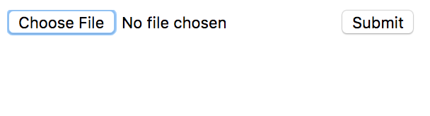
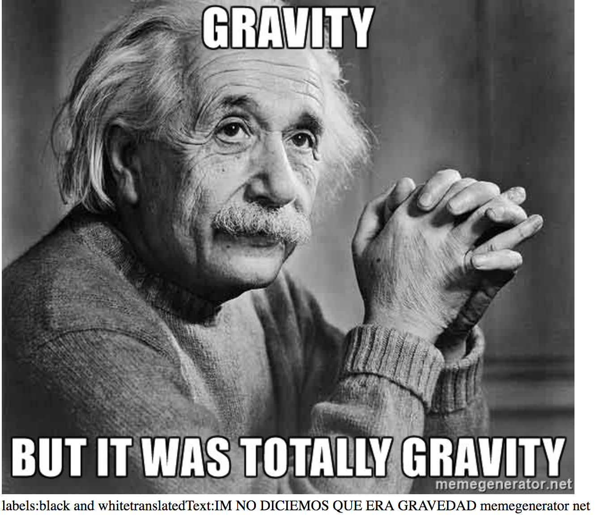
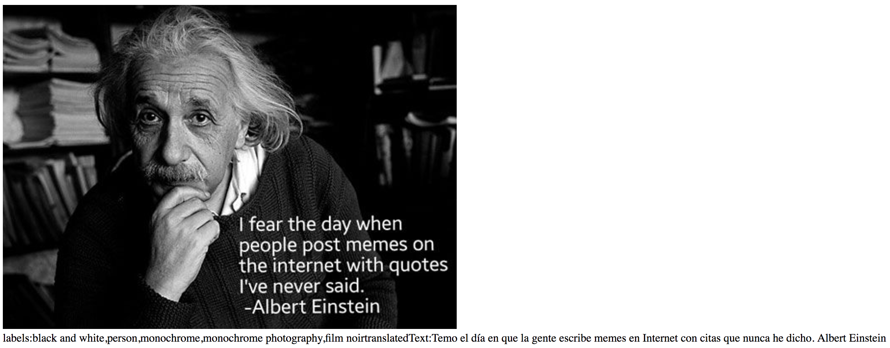

# Assignment 02

**RESTful Project**

## Assignment Specification
Develop a small project using a RESTful API of your own choice. 
You may combine two or more APIs if you need to.
*The only minimum requirement is to demonstrate usage at least 5 different API requests*

## Projects for inspiration
* Giorgio Cam (Google AI Experiments) https://aiexperiments.withgoogle.com/giorgio-cam
* Thing translator (Google AI Experiments) https://aiexperiments.withgoogle.com/thing-translator

## Submission Details
By using Google Vision API I tried to create a simple web app which can be used to analyze ‘labels', 'text', 'faces’ on a given image and with the help of Google Translate API I translate the detected text on the image from English to Spanish. To be able to upload image I am using Multer and Morgan dependencies.
Notes for myself: 
* Morgan is basically a logger, on any requests being made,it generates logs automatically. 
* Multer is a node.js middleware for handling multipart/form-data, which is primarily used for uploading files.

## Screens

## Running
- $> npm install
- $> bower install
- $> npm start
- you should put your apikey to inside of .env file (no need to set in the code)
- you should put your keyfile.json file
- localhost:8080/upload page is for uploading a photo

## My Resources
* Node.js essential training https://www.lynda.com/Node-js-tutorials/Node-js-Essential-Training/417077-2.html
* Google Cloud SDK https://cloud.google.com/sdk/docs/initializing
* Google Cloud Vision API Documentation https://cloud.google.com/vision/docs/quickstart#set_up_a_google_cloud_vision_api_project
* Google Translator API Documentation https://cloud.google.com/translate/docs/
* Google Vision API Tutorials https://cloud.google.com/vision/docs/tutorials
* Using Cloud Vision API with Node.js https://codelabs.developers.google.com/codelabs/cloud-vision-nodejs/index.html?index=..%2F..%2Findex#1
* Using Cloud Vision API with Node.js over a project https://medium.com/google-cloud/using-the-google-cloud-vision-api-with-node-js-194e507afbd8
* Google’s Cloud Vision API is Fun, Says a Girl Who Used to Sell Clothes in Tokyo https://blog.chibicode.com/googles-cloud-vision-api-is-fun-says-a-girl-who-used-to-sell-clothes-in-tokyo-b31bd4b2a9f4
* GoogleCloudPlatform/nodejs-docs-samples https://github.com/GoogleCloudPlatform/nodejs-docs-samples

## Resources
* [Video: REST API concepts and examples](https://www.youtube.com/watch?v=7YcW25PHnAA)
* [Video: RESTful API From Scratch Using Node, Express and MongoDB](https://www.youtube.com/watch?v=eB9Fq9I5ocs)
* [HTTP Request Methods](https://developer.mozilla.org/en-US/docs/Web/HTTP/Methods)
* [Video: Intro to websockets](https://www.youtube.com/watch?v=ZSRNNqh5Xo8)
